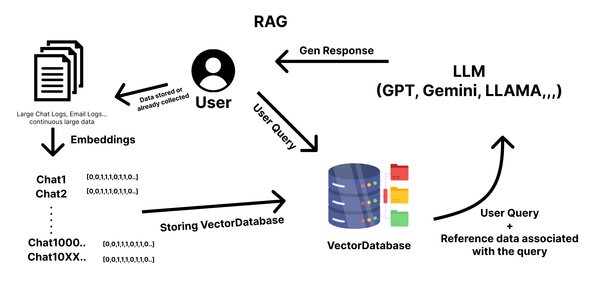
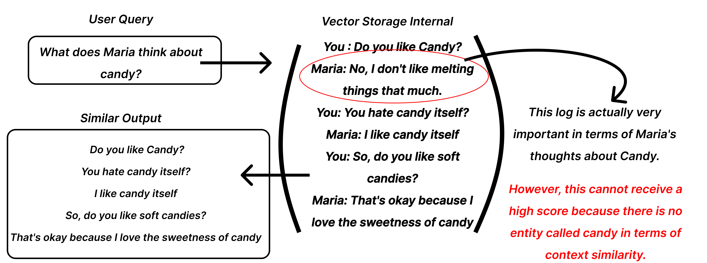
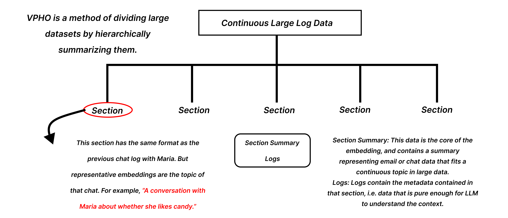

# Kuentra Official RAG "VPHO(Versatile Partitioned Hierarchical Organization)"

### VPHO(Versatile Partitioned Hierarchical Organization) is one of the methodologies developed by Kuentra for RAG, designed to enable LLMs to efficiently recognize the overall context in consecutive large-scale chat logs and email records.

#### Before considering VPHO, it is important to note that although embedding allows computers to distinguish natural language somewhat like humans, they are still not human. For computers, a large volume of data is just a vast amount of information, not separate, distinct chat rooms.


Traditional RAG is useful for embedding documents in large chunks or when each row contains important data (for example, finding the latest movie reviews through movie reviews). However, in cases like chat logs where the relevant part might have low similarity from a computer's perspective but contains crucial information to understand the flow of the conversation, traditional methods may fall short.


In cases like the one above, when a user asks a question through a chat, the computer examines the similarity between "candy" and "Maria's thoughts." In this scenario, simply embedding each sentence individually does not reveal which candy Maria dislikes and which candy she finds acceptable.


VPHO is a simple structural approach rather than a complex tree structure. When dealing with large amounts of chat data, we divide the data into related sections and summarize each section. In this way, even when additional data is introduced, we can efficiently embed only the relevant parts without re-embedding the entire dataset by considering only the final processed parts. This allows us to see the overall log of the data we are looking for, enabling the LLM to provide more precise answers.

## Let's compare the differences using a simple structured format.

```json
[
  {
    "section": "Proposal for 'CXMAHO' fiber distribution with Company A",
    "mails": [
      {
        "description": "Have you reviewed the proposal we provided for CXMAHO?",
        "caller": "Our Company"
      },
      {
        "description": "We have reviewed the proposal. However, the heat resistance of the proposed product does not meet our standards, so we find it difficult to proceed.",
        "caller": "Company A"
      },
      {
        "description": "We have another fiber called VXKWSA with higher heat resistance. May we send you a proposal for this product?",
        "caller": "Our Company"
      },
      {
        "description": "Yes, please send us the proposal for that product.",
        "caller": "Company A"
      }
    ]
  },
  {
    "section": "Proposal for 'VXKWSA' fiber distribution with Company A",
    "mails": [
      {
        "description": "We have sent you the proposal for VXKWSA fiber, which has higher heat resistance as requested. Please review and provide feedback.",
        "caller": "Our Company"
      },
      {
        "description": "We have reviewed the proposal again. It seems that VXKWSA has indeed higher heat resistance compared to CXMAHO. However, the pricing does not fit our budget, so we find it difficult to proceed at this time.",
        "caller": "Company A"
      },
      {
        "description": "It's unfortunate. However, we are always available, so please contact us if the fiber fits your needs in the future.",
        "caller": "Our Company"
      },
      {
        "description": "Thank you for your time. We hope to be good partners in the future.",
        "caller": "Company A"
      }
    ]
  },
  {
    "section": "Proposal for 'CXMAHO' fiber distribution with Company B",
    "mails": [
      {
        "description": "Have you reviewed the proposal we provided for CXMAHO?",
        "caller": "Our Company"
      },
      {
        "description": "Sorry, we are currently dealing with another company for CXMAHO.",
        "caller": "Company B"
      },
      {
        "description": "Understood. Please contact us in the future if there is an opportunity to work together.",
        "caller": "Our Company"
      }
    ]
  },
  {
    "section": "Proposal for 'CXMAHO' fiber distribution with Company C",
    "mails": [
      {
        "description": "Have you reviewed the proposal we provided for CXMAHO?",
        "caller": "Our Company"
      },
      {
        "description": "Yes, could you please tell us the adjustable range for the unit price if we import over 1,000 units?",
        "caller": "Company C"
      },
      {
        "description": "For direct import, we can adjust the price from $200 to $176.",
        "caller": "Our Company"
      }
    ]
  }
]
```

This is a scenario created with a fictional trading company proposing a fictional fiber.

```python
import json
import chromadb
from sentence_transformers import SentenceTransformer

file_path = 'data.json'
with open(file_path, 'r') as file:
    data = json.load(file)

model = SentenceTransformer('sentence-transformers/paraphrase-multilingual-MiniLM-L12-v2')

def get_embedding(text):
    return model.encode(text).tolist()

client = chromadb.Client()

collection = client.create_collection(name="rag")

idx = 0
for entry in data:
    for mail in entry["mails"]:
        text = f"{mail['caller']}: {mail['description']}"
        embedding = get_embedding(text)
        metadata = {
            "caller": mail["caller"],
            "description": mail["description"]
        }
        collection.add(
            ids=[str(idx)],
            embeddings=[embedding],
            metadatas=[metadata]
        )
        idx += 1

print("Data inserted into ChromaDB successfully.")

query = "How did Company A respond about CXMAHO?"
query_embedding = get_embedding(query)

results = collection.query(query_embeddings=[query_embedding], n_results=3)


print("----------------------------------")
print("")
print("")
print(results)
print("")
print("")
print("----------------------------------")
```

OutPut

```sh
{'ids': [['9', '0', '11']], 'distances': [[8.449447631835938, 10.806978225708008, 10.806978225708008]], 'metadatas': [[{'caller': 'Company B', 'description': 'Sorry, we are currently dealing with another company for CXMAHO.'}, {'caller': 'Our Company', 'description': 'Have you reviewed the proposal we provided for CXMAHO?'}, {'caller': 'Our Company', 'description': 'Have you reviewed the proposal we provided for CXMAHO?'}]], 'embeddings': None, 'documents': [[None, None, None]], 'uris': None, 'data': None}
```

---

As mentioned earlier, in such cases, the computer cannot yet flexibly interpret natural language like humans and only finds results based on the strict similarities it recognizes. Therefore, it cannot provide the answers we are looking for.

### Now, let's try again using the VPHO structure.

```python
import json
import chromadb
from sentence_transformers import SentenceTransformer

file_path = 'data.json'
with open(file_path, 'r') as file:
    data = json.load(file)

model = SentenceTransformer('sentence-transformers/paraphrase-multilingual-MiniLM-L12-v2')

def get_embedding(text):
    return model.encode(text).tolist()

client = chromadb.Client()

collection = client.create_collection(name="vpho_rag")

idx = 0
for entry in data:
    metadata = {
        "logs": json.dumps(entry["mails"]),
    }
    section_text = entry["section"]
    embedding = get_embedding(section_text)
    print(entry)
    collection.add(
        ids=[str(idx)],
        embeddings=[embedding],
        metadatas=[metadata]
    )
    idx += 1

print("Data inserted into ChromaDB successfully.")


query = "How is the discussion about CXMAHO with Company A going?"
query_embedding = get_embedding(query)

results = collection.query(query_embeddings=[query_embedding], n_results=1)

print("----------------------------------")
print("")
print("")
print(results)
print("")
print("")
print("----------------------------------")
```

---

## OutPut

```sh
{'ids': [['0']], 'distances': [[18.791038513183594]], 'metadatas': [[{'logs': '[{"description": "Have you reviewed the proposal we provided for CXMAHO?", "caller": "Our Company"}, {"description": "We have reviewed
the proposal. However, the heat resistance of the proposed product does not meet our standards, so we find
it difficult to proceed.", "caller": "Company A"}, {"description": "We have another fiber called VXKWSA with higher heat resistance. May we send you a proposal for this product?", "caller": "Our Company"}, {"description": "Yes, please send us the proposal for that product.", "caller": "Company A"}]'}]], 'embeddings': None, 'documents': [[None]], 'uris': None, 'data': None}
```

---

By finding summaries that are similar to our desired questions and sharing the relevant data, the LLM can easily understand and provide the desired answers.
